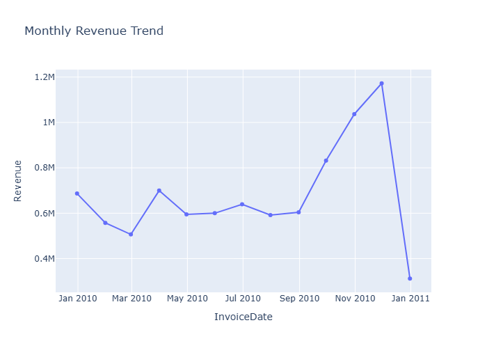
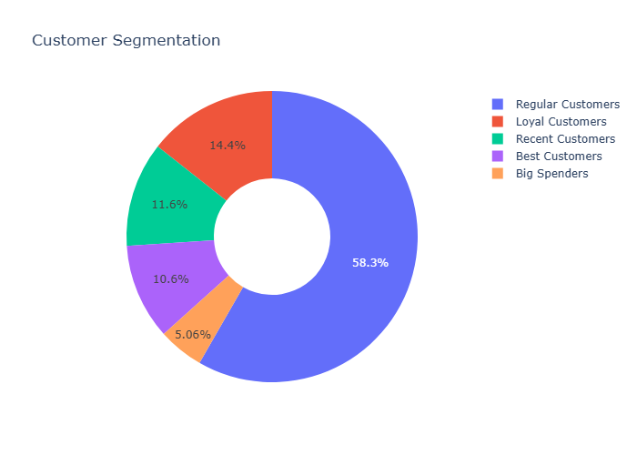
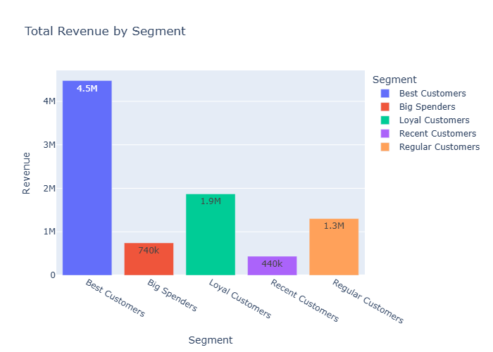
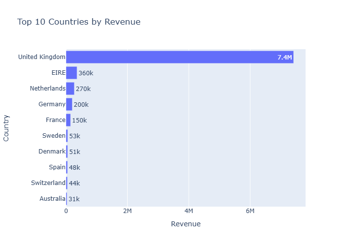
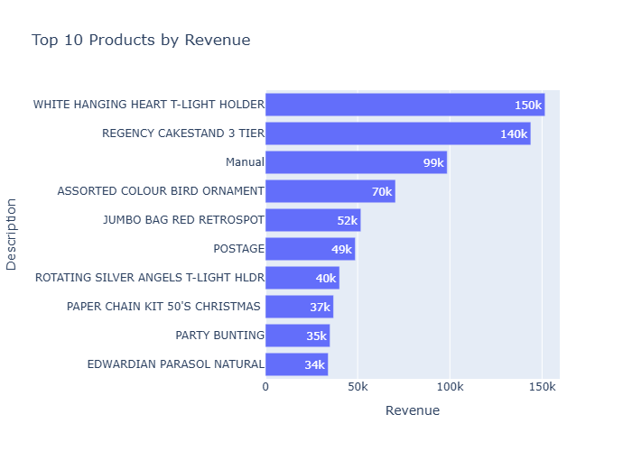
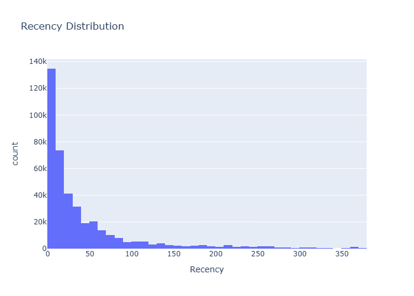
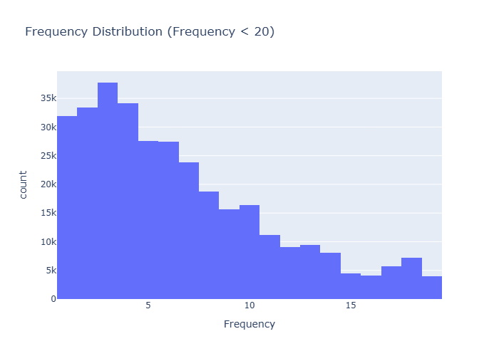
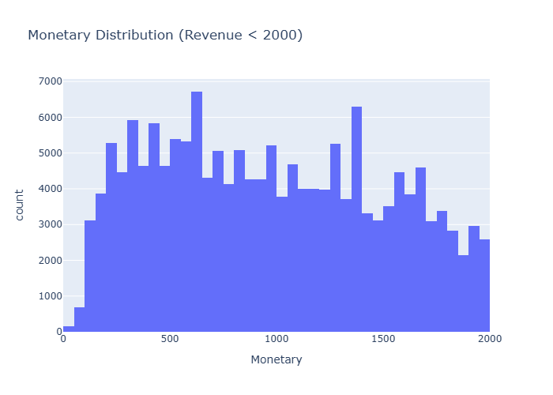

# 📊 Sales Data Analysis & Dashboarding

## Overview
This project performs a comprehensive analysis of Online Retail sales data to uncover key business insights. It includes a robust data processing pipeline, **RFM (Recency, Frequency, Monetary) analysis** for customer segmentation, and interactive dashboards built with **Streamlit**, **Tableau**, and **Power BI**.

## 🚀 Key Features
- **Data Cleaning & Preprocessing**: Automated handling of missing values, negative transactions, and data type standardization.
- **Feature Engineering**: Calculation of total revenue, customer metrics, and date-based features.
- **RFM Analysis**:
    - **Recency**: Days since last purchase.
    - **Frequency**: Total number of transactions.
    - **Monetary**: Total revenue generated.
    - **Segmentation**: Categorizing customers into segments like 'Best Customers', 'Loyal Customers', 'Big Spenders', and 'Lost Customers'.
- **Interactive Dashboards**:
    - **Streamlit**: A fully functional, code-based Python dashboard.
    - **Tableau & Power BI**: Detailed implementation guides provided.

## 🛠️ Technologies Used
- **Python**: Core programming language.
- **Pandas**: Data manipulation and analysis.
- **Plotly**: Interactive visualizations.
- **Streamlit**: Web application framework for the dashboard.
- **Tableau / Power BI**: Business Intelligence tools (guides included).

## 📂 Project Structure
```
├── online_retail_II.xlsx        # Raw Data Source
├── processed_online_retail.csv  # Cleaned Data with RFM Scores (Generated)
├── Sales_analysis.ipynb         # Exploratory Data Analysis (EDA) Notebook
├── process_data.py              # Automated Data Processing Script
├── dashboard.py                 # Streamlit Dashboard Application
├── dashboard_design.md          # Dashboard Design Specification
├── tableau_guide.md             # Guide to build Tableau Dashboard
├── powerbi_guide.md             # Guide to build Power BI Dashboard
└── README.md                    # Project Documentation
```

## ⚙️ Setup & Usage

### 1. Prerequisites
Ensure you have Python installed. Install the required dependencies:
```bash
pip install pandas plotly streamlit openpyxl
```

### 2. Data Processing
Run the processing script to clean the data and generate RFM segments:
```bash
python process_data.py
```
*Output: `processed_online_retail.csv`*

### 3. Run Dashboard (Streamlit)
Launch the interactive dashboard locally:
```bash
streamlit run dashboard.py
```
This will open the dashboard in your default browser (usually http://localhost:8501).

## 📊 Insights & Metrics
- **Total Revenue**: Calculated from Quantity * UnitPrice.
- **Customer Segments**:
    - **Best Customers**: High R, F, and M scores.
    - **Loyal Customers**: High Frequency.
    - **Big Spenders**: High Monetary value.
    - **Recent Customers**: Low Recency (recently purchased).
- **Geographic Trends**: Analysis of top performing countries.
- **Product Performance**: Identification of top-selling products.

## 📈 Visualizations

*Figure 1: Monthly Revenue Trend*


*Figure 2: Customer Segmentation Distribution*


*Figure 3: Total Revenue by Customer Segment*


*Figure 4: Top 10 Countries by Revenue*


*Figure 5: Top 10 Products by Revenue*


*Figure 6: Recency Distribution (Days since last purchase)*


*Figure 7: Frequency Distribution (Number of purchases)*


*Figure 8: Monetary Distribution (Total Revenue)*

---
*Created by [Kiran Kumar]*
